UVR1611 Data Logger Pro
======

Der *UVR1611 Datalogger Pro* ist ein webbasierender Datenlogger für die Universalregelung UVR1611 von TA mithilfe des BL-NET über den CAN-Bus und DL.

Die Features sind:
* Datenlogging über CAN-Bus und DL in eine MySQL Datenbank
* Web-Interface
* Onlinegrafik
* Temperaturkurven (Tages und Wochenansicht)
* Leistungskurven (Tages und Wochenansicht)
* Ertragsdiagramme (Monats und Tagesgruppierung)
* Zoomen in den Diagrammen
* Übersichtstabellen zu den Diagrammen
* Monatliche Trendwerte

Ein Beispiel der Anwendung befindet sich hier: [Demo](http://berwinter.dyndns.org/uvr1611/)

Downloads
------

* [Stable (v81)](https://github.com/berwinter/uvr1611/archive/v80.zip)
* [Development](https://github.com/berwinter/uvr1611/archive/master.zip)

Vorteile der Anwendung
------

Der BL-Net besitzt nur eine begrenzte Speicherkapazität und die Heizungsdaten müssen deshalb regelmäßig – manuell – ausgelesen werden, damit sie nicht verloren gehen. Der direkte Webzugriff auf den BL-Net durch externe Nutzer ist in mehrfacher Hinsicht unvorteilhaft (Sicherheit und Überlastung). Das Speichern und Auslesen der Daten aus der SQL Datenbank verhindert diese Problematik.

Installation
------

Für die Anwendung wird ein Webserver mit PHP und ein MySQL Datenbank-Server benötigt. Die benötigten Pakete können unter Debian/Ubuntu mit folgendem Befehl installiert werden:

	sudo apt-get install lighttpd php5-cgi mysql-server mysql-client php5-mysql
	sudo lighttpd-enable-mod fastcgi-php
	sudo service lighttpd force-reload

Danach kann die Anwendung in den Ordner `/var/www/` kopiert werden. Zum erstellen der Datenbankstruktur kann das Skript `sql/structure.sql` importiert werden. 

Die Anwendung benötigt zur Laufzeit Schreibrechte für den Ordner `/tmp/`.

Konfiguration
------

Die Konfiguration des Datenloggers befindet sich in der Datei `config/config.ini`:
 
	[mysql]
	server = localhost
	user = uvr1611
	password = uvr1611
	database = uvr1611
	
	[uvr1611]
	address = 10.0.0.100
	port = 40000
	reset = false
	
	[app]
	name = "Solar/Heizungs Datenauswertung"
	email = bertram.winter@gmail.com
	chartcache = 600
	latestcache = 60
	reduction = 2

In der Sektion `mysql` befinden sich die Parameter für den Zugang zur Datenbank. Der angebene Datenbank-Benutzer benötigt die Rechte `DELETE`, `EXECUTE`, `INSERT`, `SELECT`, `SHOW VIEW` und `UPDATE` für die Datebank. In der Sektion `uvr1611` befinden sich die IP-Adresse für den BL-NET. Mit dem Schalter `reset` kann das Löschen der Daten vom BL-NET nach dem Logging aktiviert werden. Der Bereich `app` legt Einstellungen zur Anwendung fest. Anwendung fest. Unter `name` kann der Eintrag „Solar/Heizungs Datenauswertung“ durch einen individuellen Eintrag ersetzt werden, ebenso der Eintrag unter `email`. `chartcache` und `latestcache` legen den Zeitraum in Sekunden fest, in dem keine neuen Daten vom Bootloader geholt werden. `reduction` reduziert die Daten in den Diagrammen um den angegebenen Faktor.

Automatisches abrufen der Daten
------
Damit die Daten automatisch vom BL-Net geholt werden, kann ein cron-Job mit folgendem Inhalt angelegt werden (z.B.: als `/etc/cron.hourly/uvr1611-logger`): 

	#!/bin/bash

	wget 'http://localhost/uvr1611/analogChart.php' -O /dev/null

Anpassen der Anwendung
------

Die Anpassung der Anwendung erfolgt vollständig über die Datenbank:
(Im Ordner `sql/example-data` befinden sich Beispieldaten der einzelnen Tabellen zum Importieren.)

Bevor die Tabellen importiert werden, empfiehlt es sich, das Schema/Schema und Schema/Kollektoren ggf. an die eigenen Verhältnisse anzupassen, indem diese Dateien mit einem entsprechenden Grafik Programm bearbeitet werden. Das Freeware Programm Inkscape für PC und Mac eignet sich sehr gut, weil das Festlegen der ID’s besonders einfach ist. Die ID’s werden später in der Tabelle `t_schema` benötigt und nachstehend wird kurz gezeigt, wie diese festgelegt werden.
Nachdem die Grafik angepasst wurde, setzt man mit dem Texttool an den Stellen im Diagramm, wo später z.B. die Temperatur angezeigt werden soll ein `? ° C`, klickt mit der rechten Maustaste auf dieses Objekt und es öffnet sich das nachstehende erste Fenster. Dort wird *Object Properties* angeklickt und das rechte Fenster erscheint. In diesem Fenster legt man mit einer freien Bezeichnung die *ID* und das *Label* fest. Im Beispiel ist die ID `vl2_temp` und das Label `#vl2_temp`. Der Label Eintrag wird später in der Tabelle `t_schema` unter `path` eingetragen.

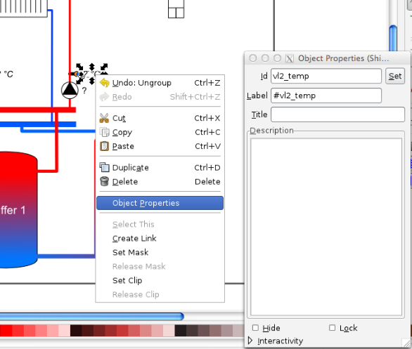

Sind alle ID’s festgelegt, wird diese Datei im Ordner unter `images` gespeichert.

#### t_menu ####

In dieser Tabelle wird die Haupteingangsseite festgelegt. `name` und `order` sind frei festlegbar, wobei `order` die Reihenfolge der einzelnen Darstellungen in der Haupt-Menu Anzeige festlegt.
Werden einzelne Bereiche nicht benötigt, können diese Reihen einfach in der Tabelle gelöscht werden.

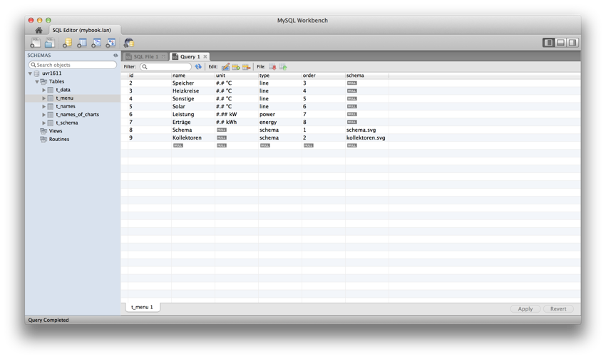

#### t_names ####

In der Spalte `type` wird die aktuelle Belegung der 16 analogen UVR Sensoren Eingänge eingetragen. Unter `name` kann man angeben, welcher Eingang hier geschaltet ist. Nicht benötigte Eingänge werden wieder einfach reihenweise gelöscht.

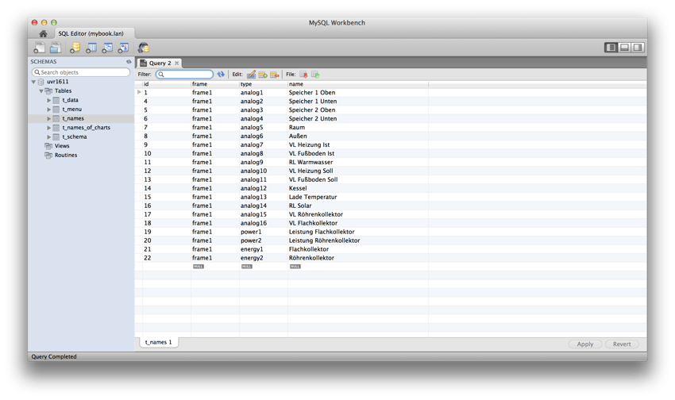

#### t_names_of_charts ####

In dieser Tabelle wird festgelegt, welche Diagramme erzeugt werden sollen. Dabei wird mit der `chart_id` festgelegt, in welchem Chart welche Größen angezeigt werden sollen. Mit `order` wird bestimmt an welcher Stelle im Chart und der darunter liegenden Tabelle ein Wert angezeigt werden soll.
Soll ein Wert in mehreren Charts angezeigt werden, so muss dieser Wert entsprechend oft in `t_names_of_charts` aufgeführt werden. Im nachstehenden Beispiel ist das z.B. die Größe `analog12`. Dieser Wert wird sowohl im Chart 2 des Hauptmenues, als auch im Chart 4 angezeigt

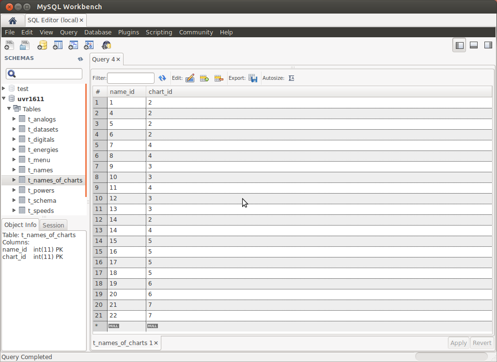

#### t_schema ####
Hier werden die Label-Einträge - wie vorstehend - erläutert eingetragen. Auch die Pumpen, Mischer und Ventil Einstellungen können hier festgelegt werden. Im nachstehenden Beispiel sind dies die digital-Einträge unter `type`. Im Schema erscheinen diese Einträge dann mit ihren aktuellen Zustand `EIN` oder `AUS`.

Als Formatierung kann die Anzahl der Kommastellen angegeben werden (zB.: #.## für 2 Kommastellen). Für die digitalen Ausgänge kann die Funktion `DIGITAL()` verwendet werden um EIN bzw. AUS im Schema anzuzeigen. Für Ventile und Mischer gibt es die Funktionen `MISCHER_AUF()`, `MISCHER_ZU()` und `VENTIL()`. Mischer zeigen den aktuellen Zustand AUF/ZU an und im Ruhezustand erfolgt keine Anzeige. Ventile zeigen den Zustand OFFEN/ZU an. Im nachstehenden Beispiel ist der Heizkreis-Mischer (Ausgang „digital 8“ ) für den Zustand „AUF“ definiert.

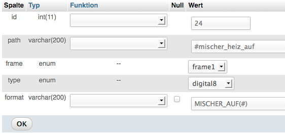

Für die Darstellung der Erträge stehen die Funktionen `MWH()` und `KWH()` zur Verfügung. 

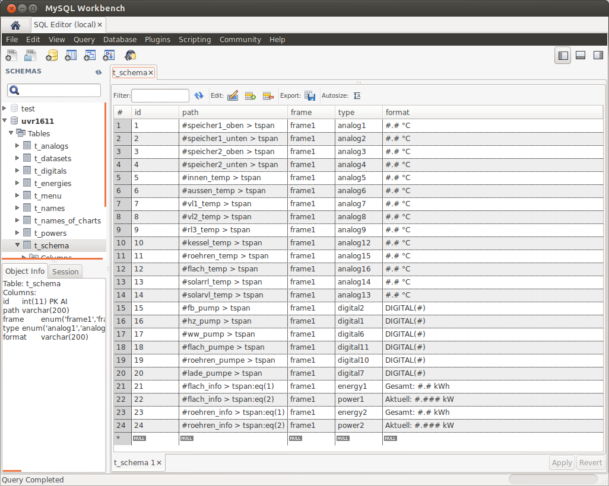

Screenshots
------

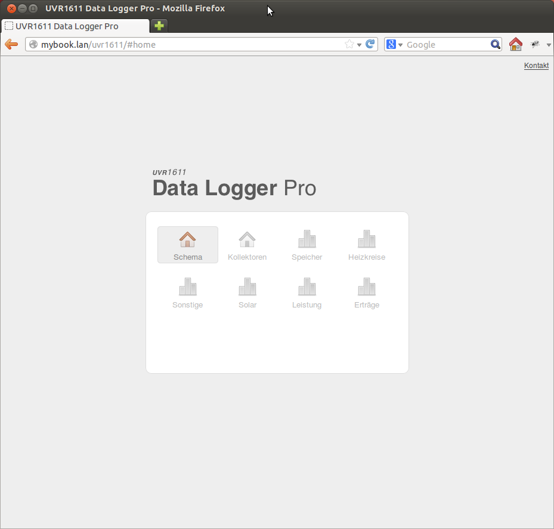

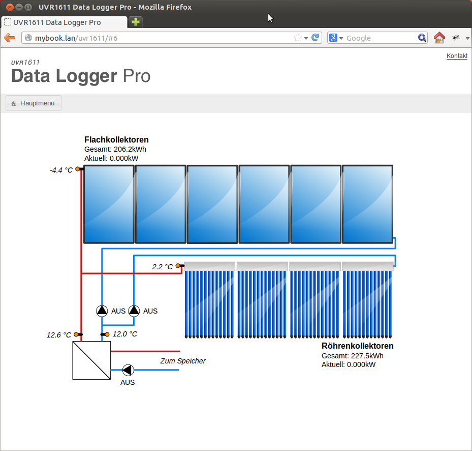

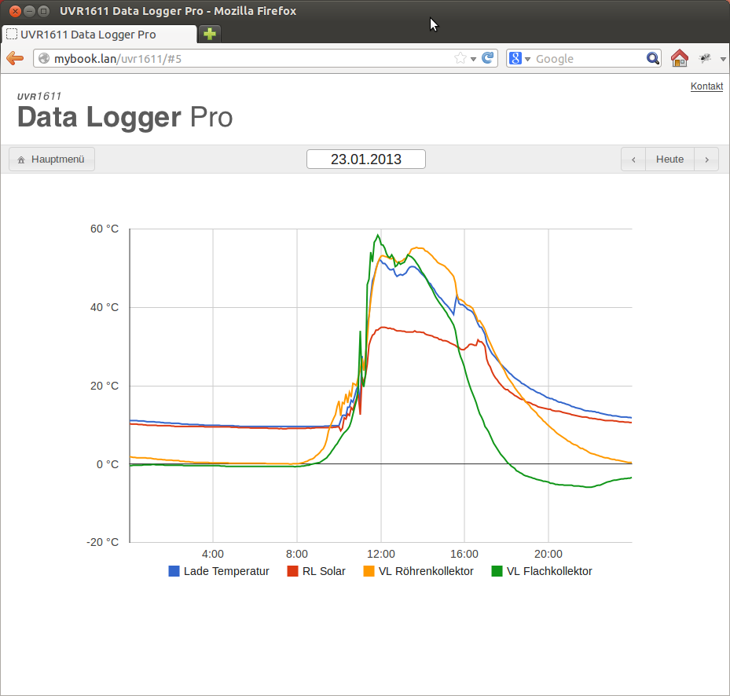

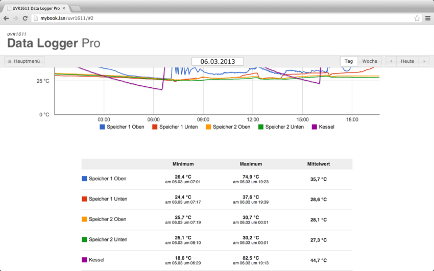

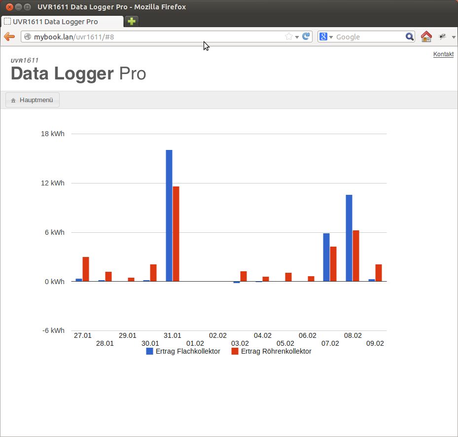

Kontakt
------
Bertram Winter
bertram.winter@gmail.com
